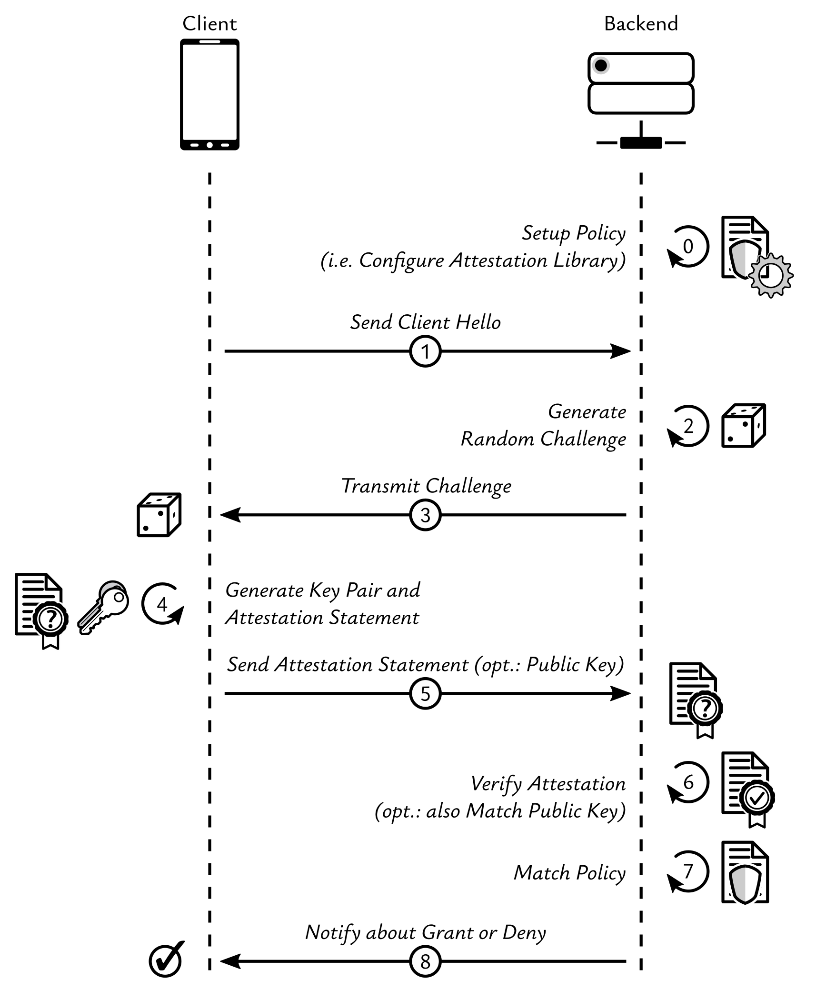
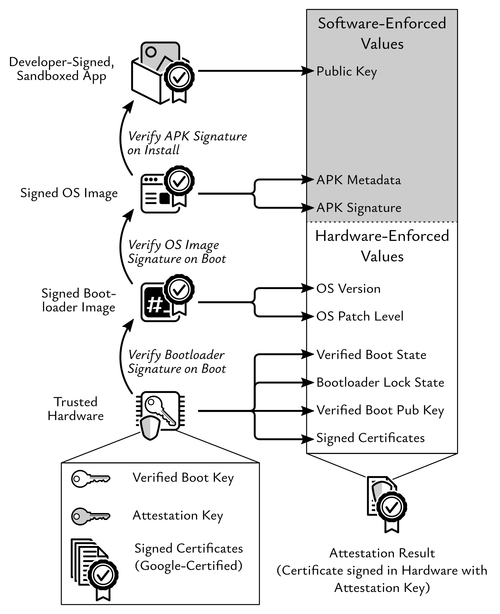

# Server-Side Mobile Client Attestation Library

[](http://www.apache.org/licenses/LICENSE-2.0) 
[](http://kotlinlang.org)


[](https://mvnrepository.com/artifact/at.asitplus/attestation-service/)

Server-side library providing a unified interface for key attestation compatible with Android and iOS (yes, even iOS!).
It also provides App attestation on both platforms (see [our 2019 Paper](https://graz.elsevierpure.com/en/publications/fides-unleashing-the-full-potential-of-remote-attestation) 
on how to remotely establish trust in Android applications for more Android-specifics on this matter).

Under the hood, this library depends on the [Android Key Attestation Library](https://github.com/a-sit-plus/android-attestation) and
[Vincent Haupert's](https://github.com/veehaitch)  excellent [DeviceCheck/AppAttest Library](https://github.com/veehaitch/devicecheck-appattest).

Full API docs are available [here](https://a-sit-plus.github.io/attestation-service/).

## Demonstration / Usage Example
This library is intended for integration into back-end services which need to remotely establish trust in mobile clients
(both Android and iOS). Usually, this means that mobile client initially request a binding certificate from the back-end
based on a public/private key pair stored inside cryptographic hardware.
This binding is only granted if device and app integrity can be verified, and if the key can be proven to be stored in hardware.
<br>
Once a binding has been obtained, mobile clients can subsequently authenticate to the back-end (e.g. to access some protected
resource). However, far more flexible scenarios can be implemented. Hence, Figure&nbsp;1 depicts an abstract version of
establishing trust in mobile clients.

See the provided [sample service](https://github.com/a-sit-plus/attestation-service/tree/main/sample/backend) and its accompanying mobile clients for an MWE that integrates this library.
(The sample also contains the Android and iOS clients.)


<div style="text-align: center;">Figure 1: Abstract example usage: remotely establishing trust in mobile clients</div>

## Background
Apple and Google pursue different strategies wrt. establishing trust in mobile clients.
On Android, things are kept rather simple from a technological point of view.

### Android
Device manufacturers provision signing keys and matching certificates into secure hardware during a device's production process.
These certificates have previously been signed by Google, resulting in a certificate chain from a publicly known Google root certificate
down to virtually every individual Android device that ships with Google play services.
Apps can then generate cryptographic keys, which are securely stored in dedicated cryptographic hardware on the device
and have this hardware issue certificates for those keys.
These certificates, are signed by the private key provisioned during manufacturing.
This ultimately leads to a chain of trust from the Google root certificate to cryptographic material created
on the device.
<br>
The cryptographic material referenced by the leaf certificate can be used by the app as desired (e.g. to perform
signatures, etc.).

Although quite some properties of this certificate chain leaf need to be evaluated in a particular manner, to establish
trust in an Android client app, it is really dead-simple on a technical level: Validate the chain, and evaluate certain
extensions of the leaf certificate (Figure&nbsp;2 illustrates this high-level concept in more detail). 
iOS, on the other hand is a different beast. 


<div style="text-align: center;">Figure 2: High-level structure of an Android key attestation result</div>

### iOS
Apple relies on their own heuristics employed as part of a service operated by the company to assess whether a device
and an app can be trusted or not.
While some of the same basic principles apply here as well (i.e. keys generated in hardware come with chain of trust rooted in
an Apple certificate), the semantics are different.
Android primarily attests the properties of a cryptographic key.
Apple's [App Attest](https://developer.apple.com/documentation/devicecheck/establishing_your_app_s_integrity), on the
other hand, attests the integrity of apps.
The cryptographic material is in this case a mere vehicle to realise the idea of attesting app integrity.
Therefore, the involved key material cannot be used by the app for arbitrary cryptographic operations, but only to sign
attestations and related assertions.

This begs the question: How to enable key attestation on iOS?
After all, many applications exists, which require some proof that a key used for critical operations resides in hardware.
<br>
Here, the ability to obtain a so-called *assertion* comes to the rescue: iOS allows generating an *assertion* for some
data by signing it using the same key backing a previously obtained attestation.
By that logic, computing an assertion over a public key of a freshly generated public/private key pair, proves that an
authentic, an uncompromised app on a non-jailbroken device was used to generate this key pair as intended by the app developer.

This library abstracts away all the nitty-gritty details of this verification process and provides a unified API
which works with both Android and iOS.

## Usage
Written in Kotlin, plays nicely with Java (cf. `@JvmOverloads`), published at maven central.
### Gradle

```kotlin
 dependencies {
     implementation("at.asitplus:attestation-service:$version")
 }
```


While still not complete, the test suite in this repository should provide a nice overview. [FeatureDemonstration](https://github.com/a-sit-plus/attestation-service/blob/main/attestation-service/src/test/kotlin/FeatureDemonstration.kt),
in particular, was designed to demonstrate this library's whole API.
<br>
See the provided [sample service](https://github.com/a-sit-plus/attestation-service/tree/main/sample/backend) and its mobile clients for an MWE that integrates this library.
The sample also contains Android and iOS clients.

### Configuration
Every parameter is configurable and multiple instance of an attestation service can be created and used in parallel.
The following snippet lists all configuration values

```kotlin
val service = DefaultAttestationService(
    androidAttestationConfiguration = AndroidAttestationConfiguration(
        packageName = "at.asitplus.attestation_client",
        signatureDigests = listOf("NLl2LE1skNSEMZQMV73nMUJYsmQg7+Fqx/cnTw0zCtU=".decodeBase64ToArray()),
        androidVersion = 10000,                 //optional
        appVersion = 1,                         //optional
        patchLevel = PatchLevel(2021, 8),       //optional
        requireStrongBox = false,               //optional
        bootloaderUnlockAllowed = false,        //you don't usually want to change this
        requireRollbackResistance = false,      //depends on device, so leave off
        ignoreLeafValidity = false,             //ignore attestation leaf certificate validity (looking at you, Samsung!)
       trustAnchors = listOf(googleRootPubKey)  //OPTIONAL, defaults to google HW attestation key. Useful for automated end-to-end tests
    ),
    iosAttestationConfiguration = IOSAttestationConfiguration(
        teamIdentifier = "9CYHJNG644",
        bundleIdentifier = "at.asitplus.attestation-client",
        sandbox = false,
        iosVersion = "16" //optional, use SemVer notation
    ),
    clock = FixedTimeClock(Instant.parse("2023-04-13T00:00:00Z")), //optional
    verificationTimeOffset = Duration.ZERO //optional
)
```

The (nullable) properties like patch level, iOS version or Android app version essentially allow for excluding outdated devices.
Custom android challenge verification has been omitted by design, considering iOS constraints and inconsistencies resulting from such a costomisation.


### Obtaining an Attestation Result
1. The general workflow this library caters to assumes a back-end service, sending an attestation challenge to the mobile app. This challenge needs to be kept for future reference
2. The app is assumed to generate a key pair with attestation (passing the received challenge the platforms' respective crypto APIs)
3. The app responds with a platform-dependent attestation proof and the public key just created.
4. On the back-end, a single call to `service.verifyKeyAttestation()` (or `service.verifyAttestation()`) is sufficient to remotely verify
   whether the key is indeed stored in HW (and whether the app can be trusted). This call requires the challenge from step 1.

Various flavours of this attestation call from step 4 exist, some of which are platform-dependent
(do see [FeatureDemonstration](https://github.com/a-sit-plus/attestation-service/blob/main/attestation-service/src/test/kotlin/FeatureDemonstration.kt) for details).

#### Key Attestation 
The most important one of these is the `verifyKeyAttestation()` function, which returns a
[KeyAttestation](https://github.com/a-sit-plus/attestation-service/blob/main/attestation-service/src/main/kotlin/AttestationService.kt#L293) object.

##### Signature
```kotlin
 fun <T : PublicKey> verifyKeyAttestation(
        attestationProof: List<ByteArray>,
        expectedChallenge: ByteArray,
        keyToBeAttested: T
    ): KeyAttestation<T>
```
The returned `KeyAttestation` object contains the attested key on success.

##### Semantics

Succeeds if attestation data structures of the client (in `attestationProof`) can be verified and `expectedChallenge` matches
the attestation challenge. For Android clients, this function Makes sure that `keyToBeAttested` matches the key contained in the attestation certificate.
For iOS this key needs to be specified explicitly anyhow to emulate key attestation

The contents of **attestationProof** are platform-specific!
On Android, this is simply the certificate chain from the attestation certificate
(i.e. the certificate corresponding to the key to be attested) up to one of the
[Google hardware attestation root certificates](https://developer.android.com/training/articles/security-key-attestation#root_certificate).
on iOS this must contain the [AppAttest attestation statement](https://developer.apple.com/documentation/devicecheck/validating_apps_that_connect_to_your_server#3576643)
at index `0` and an [assertion](https://developer.apple.com/documentation/devicecheck/validating_apps_that_connect_to_your_server#3576644)
at index `1`, which, is verified for integrity and to match `keyToBeAttested`.
The signature counter in the attestation must be `0` and the signature counter in the assertion must be `1`.

Passing a public key created in the same app on the iDevice's secure hardware as `clientData` to create an assertion effectively
emulates Android's key attestation: Attesting such a secondary key through an assertion, proves that
it was also created within the same app, on the same device, resulting in an attested key, which can then be used
for general-purpose crypto.
<br>
**BEWARE: supports only EC key on iOS (either ANSI X9.63 encoded or DER encoded).**
The key can be passed in either encoding to the secure enclave when creating an assertion.

<br>

---
<p align="center">
This project has received funding from the European Union’s Horizon 2020 research and innovation
programme under grant agreement No 959072.
</p>
<p align="center">

</p>