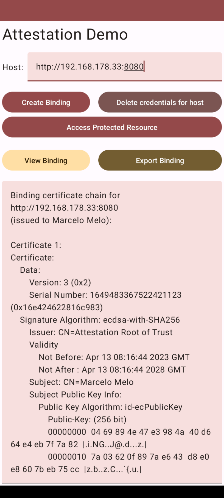

# Android Attestation Demo Client

The magic happens in [`AttestationClient`](app/src/main/java/at/asitplus/attestation_client/AttestationClient.kt):
Relevant in this context is `generateKeyPair`, which kicks-off hardware-backed key attestation and `loadCertChain`,
which encapsulates loading the certificate chain including the attestation proof for the previously generated key pair.

`createJWT` generates the JWT for authenticating to access the protected resource at the demo service.
It requires an alias to load the private key for signing and the certificate chain obtained from the service containing
the binding certificate.

[`MainAkticity.kt`](app/src/main/java/at/asitplus/attestation_client/MainActivity.kt) calls all `AttestationClient` functions.

This app also supports exporting the binding certificate chain to email.

